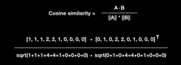
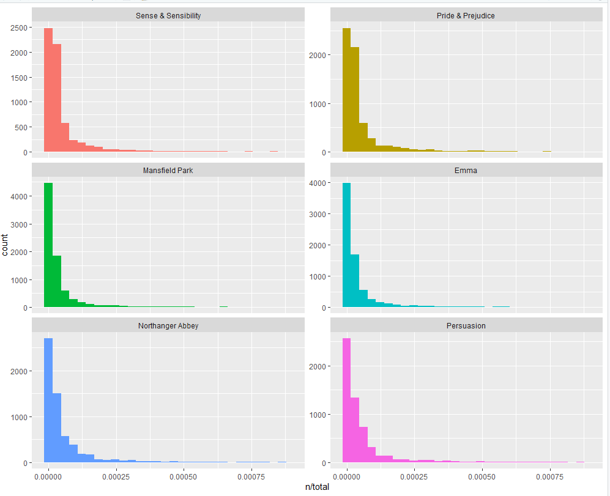
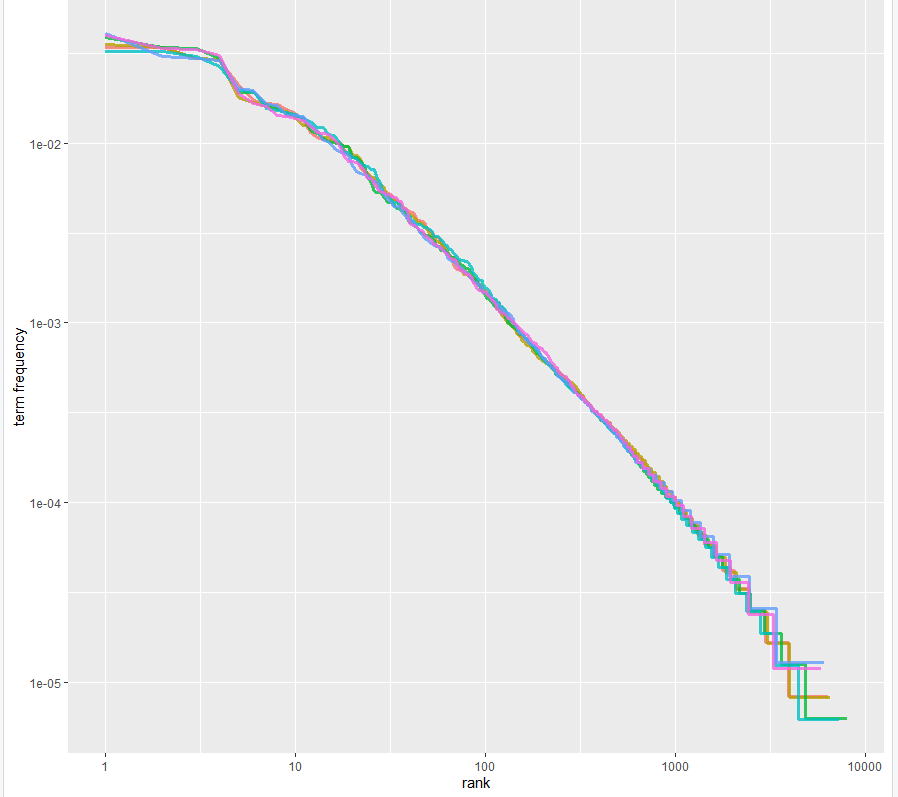
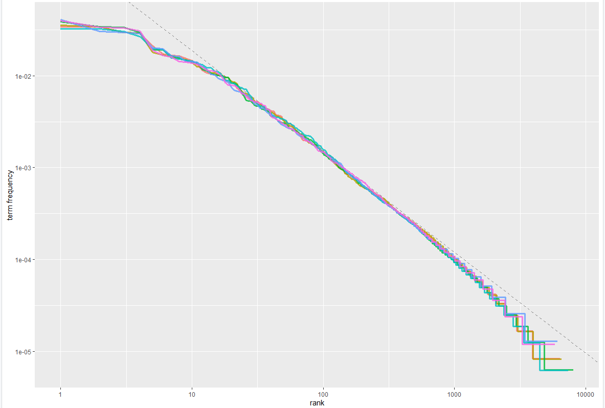
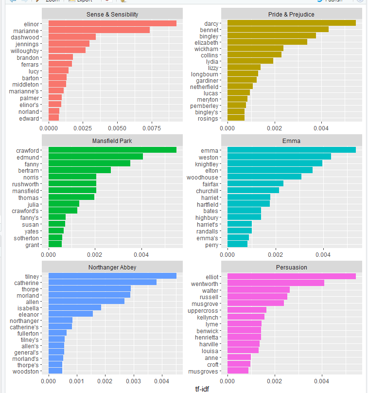

# 20191014 단어 유사성 통계 분석 방법(거리 )

> 키워드와 키워드의 거리값을 구하기 위해서 이용할 통계분석을 정하는 과정이다. 이번 프로젝트에서 뉴스기사를 형태소 분석을 한다. 형태소 분석을 마친 파일들은 한 단어 형태로 출력이 될 것이다. 각 단어는 각기 다른 횟수를 가지고 있을 것이라 예상을 한다. **그래서 이러한 빈도수를 기반으로 해서 각 단어와 기사를 찾은 키워드사이의 디스턴스를 구하는 것이 목표이다.** 
>
> 분석을 위해서는 R을 사용할 것이고, 형태소 분석은 카히 와 코모란을 사용 중 입니다.


## 1. TF-IDF


### 1-1. TF-IDF가 무엇인지 그리고 왜 필요한지

:  대량의 문서에서 키워드를 뽑는 것에는 어떤 방법이 있을까요?? 한 단어가 얼마나 자주 등장하는 것을 카운트 한다면 그 카운트 횟수가 기준이 될 수 있지 않을까요? **그래서 빈도수를 체크하기 위해서 쓰는 방식 중에  TF-IDF라는 방법이 있습니다.** 

 TF-IDF는 Tearm Frequency - inverse Document Frequency의 약자 입니다. 직역을 하자면, **'단어 빈도 - 문서 빈도 역수' 인데 이 두 값를 곱하면 문서의 키워드를 추출 할 때 사용되는 수치가 나오게 됩니다.** **<u>단 쓸모가 없는 값에서는 패널티를 주어서 가중치를 낮추는 과정을 거치게 됩니다.</u>** **그래서 빈도수가 상대적으로 낮다고 하더라도, 가중치가 있는 값이 나오게 됩니다.**


### 1-2. 예제를 보자.

1. 먼저 BoW(Bag of Words)를 구해 문서의 유사도를 구할 수 있다.
2.  bow 의 워드를 TF-IDF를 이용해서 문서의 유사도를 구할 수 있다.


> 1. the best italian restaurant enjoy the best pasta.
> 2. American restaurant enjoy the best hamburger.
> 3. Korean restaurant enjoy the best bibimbap
> 4. the best the best American restaurant


BoW처리를 해주는 1번 예제를 보자

> italian 1 / restaurant 1 /enjoy 1/ the 2 / best 2 /  pasta 1/  American  0/ ...

이라고 벡터로 표현이 되어진다.


Cosine Similarity d1:d4를 아래의 식에 대입을 해주게 된다.





> Cosine Similarity  나온다.
>
> 1. 0.82
>
> 2. 0.77
> 3. 0.65
> 4. 1 (기준이기 때문에 같은 문장이라 1이 나온다.)


**But** 4번 문장을 기준으로 했을 때 코사인 유사도가 1번과 가장 가깝게 나왔다. 하지만 이러한 유사도에는 문제가 있다.  왜냐하면 the best가 1번과 4번에서 2번씩 출현했기 때문이다. the best는 모든 문장에서 사용되어졌다. 하지만 모든 문장에서 사용되어졌다고 하더라도, 중요도에 있어서 떨어지기 때문에 단점이 되는 것이다. 그래서 이러한 점을 보완하기 위해서 만든 것이 TF-IDF이다.


> TF : Term Frequency (많을 수록 높은 값.)
>
> IDF: Inverse Document Frequency (많을수록 값을 낮춰줌.)
>
> 그래서 1번 문장을 다시 TF -IDF의 Cosine Similarity를 나타낸다면
>
> 0.075,0,0.016,0,0,0.075,0,0,0 이라는 낮은 점수가 나오게 된다.
>
> 다시 4번과 비교를 하면 0에 가까운 수가 나오게 된다.
>
> 1. 0
> 2. 0.5
> 3. 0
> 4. 1


### 1-3 . TF -IDF의 장점

- 구현하기가 쉽다.
- 중요한 단어에 점수를 그대로 유지
- 중요하지 않은 단어(빈도만 많은 단어)는 중요도를 낮춰준다.


### 1-4 . TF -IDF의 단점

- 단어만 본다. 단.. 단어 뜻의 유사도를 보지 않는다.
  - U.S President speech in public
  - Donald Trump prsentation to people
  - 어찌보면 같은 뜻으로 이루어진 문장이지만 유사도는 0
- 다른 단어인데 같은 뜻을 가진 단어를 구별하지 못한다.
  - American restaurant menu
  - American restaurant  menu hamburger pizza
  - hamburger pizza
  - 1과 3의 유사도는 0 하지만  1<-3 에 속해있기 때문.


#### 1-5 . TF -IDF의 단점 극뽁!

- LSA(Latent Semantic Analysis)
  - 위에서 말한 다른 단어이지만 뜻이 다른 단어의 유사도를 올려주는 분석
- Word Embededdings(Word2Vec, Glove)
  - 각각의 단어마다 유사도를 찾을 수 있따.
- ConcepNet (아마 다음 타겟)
  - 단어간의 유사도


> 참고
>
> 이론: https://www.youtube.com/watch?v=Rd3OnBPDRbM
>
> 자바기반 코드: https://www.youtube.com/watch?v=RPMYV-eb6lI


### 1-6. 예제 : 제인 오스틴의 책들을 이용한 TF-IDF 유사성 분석


```R
library(dplyr)
install.packages("janeaustenr")
library(janeaustenr)
install.packages("tidytext")
library(tidytext)

book_words<- austen_books() %>%
  unnest_tokens(word,text) %>%
  #새로운 데이터 프레임에서는 각 행마다 토큰이 한개만 있도록 각행이 분할된다.
  count(book,word,sort = T)

total_words <- book_words %>% 
# %>% <- chain operations https://rfriend.tistory.com/236
  group_by(book) %>% 
  summarize(total = sum(n))

print(total_words)

book_words <- left_join(book_words, total_words)

book_words
print(book_words)


결과

> print(book_words)
# A tibble: 40,379 x 4
   book              word      n  total
   <fct>             <chr> <int>  <int>
 1 Mansfield Park    the    6206 160460
 2 Mansfield Park    to     5475 160460
 3 Mansfield Park    and    5438 160460
 4 Emma              to     5239 160996
 5 Emma              the    5201 160996
 6 Emma              and    4896 160996
 7 Mansfield Park    of     4778 160460
 8 Pride & Prejudice the    4331 122204
 9 Emma              of     4291 160996
10 Pride & Prejudice to     4162 122204
```


```r
ggplot(book_words,aes(n/total,fill=book)) +

#aes(x=length, y=width)’ 코드가 의미하는 바는 x축에 length 컬럼을 매칭시키고, y축에 width 컬럼을 매칭시키라는 것이다.

  geom_histogram(show.legend = F) +
  xlim(NA, 0.0009) +
  facet_wrap(~book, ncol = 2,scales = 'free_y')

결과

`stat_bin()` using `bins = 30`. Pick better value
with `binwidth`.
Warning messages:
1: Removed 896 rows containing non-finite values
(stat_bin). 
2: Removed 6 rows containing missing values
(geom_bar). 
```




```R
freq_by_rank <- book_words %>% 
  group_by(book) %>% 
  mutate(rank = row_number(), 
         `term frequency` = n/total)

freq_by_rank

결과

book  word      n  total  rank
   <fct> <chr> <int>  <int> <int>
 1 Mans~ the    6206 160460     1
 2 Mans~ to     5475 160460     2
 3 Mans~ and    5438 160460     3
 4 Emma  to     5239 160996     1
 5 Emma  the    5201 160996     
    .
    .
    .
```





```R
> freq_by_rank %>% 
+   ggplot(aes(rank, `term frequency`, color = book)) + 
+   geom_line(size = 1.1, alpha = 0.8, show.legend = FALSE) + 
+   scale_x_log10() +
+   scale_y_log10()
> rank_subset <- freq_by_rank %>% 
+   filter(rank < 500,
+          rank > 10)
> lm(log10(`term frequency`) ~ log10(rank), data = rank_subset)

Call:
lm(formula = log10(`term frequency`) ~ log10(rank), data = rank_subset)

Coefficients:
(Intercept)  log10(rank)  
    -0.6226      -1.1125 
```


```r
freq_by_rank %>% 
  ggplot(aes(rank, `term frequency`, color = book)) + 
  geom_abline(intercept = -0.62, slope = -1.1, color = "gray50", linetype = 2) +
  geom_line(size = 1.1, alpha = 0.8, show.legend = FALSE) + 
  scale_x_log10() +
  scale_y_log10()
```





```r
book_words <- book_words %>%
  bind_tf_idf(word, book, n)

book_words

결과

 book              word      n  total     tf   idf tf_idf
   <fct>             <chr> <int>  <int>  <dbl> <dbl>  <dbl>
 1 Mansfield Park    the    6206 160460 0.0387     0      0
 2 Mansfield Park    to     5475 160460 0.0341     0      0
 3 Mansfield Park    and    5438 160460 0.0339     0      0
 4 Emma              to     5239 160996 0.0325     0      0
 5 Emma              the    5201 160996 0.0323     0      0
 6 Emma              and    4896 160996 0.0304     0      0
 7 Mansfield Park    of     4778 160460 0.0298     0      0
 8 Pride & Prejudice the    4331 122204 0.0354     0      0
 9 Emma              of     4291 160996 0.0267     0      0
10 Pride & Prejudice to     4162 122204 0.0341     0      0
# ... with 40,369 more rows

```


```r
book_words %>%
  select(-total) %>%
  arrange(desc(tf_idf))

결과

book                word          n      tf   idf  tf_idf
   <fct>               <chr>     <int>   <dbl> <dbl>   <dbl>
 1 Sense & Sensibility elinor      623 0.00519  1.79 0.00931
 2 Sense & Sensibility marianne    492 0.00410  1.79 0.00735
 3 Mansfield Park      crawford    493 0.00307  1.79 0.00551
 4 Pride & Prejudice   darcy       373 0.00305  1.79 0.00547
 5 Persuasion          elliot      254 0.00304  1.79 0.00544
 6 Emma                emma        786 0.00488  1.10 0.00536
 7 Northanger Abbey    tilney      196 0.00252  1.79 0.00452
 8 Emma                weston      389 0.00242  1.79 0.00433
 9 Pride & Prejudice   bennet      294 0.00241  1.79 0.00431
10 Persuasion          wentworth   191 0.00228  1.79 0.00409
# ... with 40,369 more rows
```


```r
book_words %>%
  arrange(desc(tf_idf)) %>%
  mutate(word = factor(word, levels = rev(unique(word)))) %>% 
  group_by(book) %>% 
  top_n(15) %>% 
  ungroup() %>%
  ggplot(aes(word, tf_idf, fill = book)) +
  geom_col(show.legend = FALSE) +
  labs(x = NULL, y = "tf-idf") +
  facet_wrap(~book, ncol = 2, scales = "free") +
  coord_flip()
```





