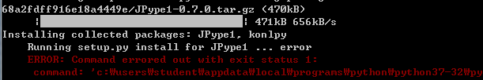
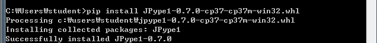
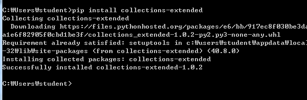

# 20191016 파이썬을 이용한 단어 빈도수 계산 


### 1. 환경 설정


코딩을 하기 전에 앞서서 Konply가 필요합니다.  그래서 cmd창을 열어서 

```r
pip install Konlpy
```

실행 해준다. 그런데.. 에러가 발생 !!!





JPype1이 없네요... 그렇다면 해결을 해야죠 ^^ 아래에 wheel 형식의 파일을 받는 사이트를 링크해놓았습니다. 필요한 버전을 잘 찾아서 써주시면됩니다. 대신에 한가지 알아두셔야 할 것은, amd64 가 있는데 이게 64bit 이기는  한데, amd 를 쓰시는 분에만 해당하는 것 같습니다. 아마 다운받아도 install 되지 않으실거예요. 그래서 꼭 32bit를 다운 받으시길 말씀드립니다.

> https://www.lfd.uci.edu/~gohlke/pythonlibs/#jpype




> 참고 사이트: https://blog.naver.com/rjs5730/220979230787


### 2. 코딩을 시작하다.

 위에서 konply  패키지에 대한 문제는 해결을 했습니다. 그런데 임포트를 1가지 더 해줘야합니다.  collection 의 counter 입니다. 그래서 

```cmd
pip install collection 
```

을 해주니.. 에러가 뻥 ~~~~ 머지?? 해서 collection대신에 counter을 넣어줬는데 역시나 에러  인터넷에서 찾아보니  **<u>pip install collections-extended</u>** 이네요. 잠시 움찔했습니다. 하핫...휴...(스택오버플로우 짱)

```
pip install collections-extended
```





진짜 환경설정이 끝!!!! 이제 코딩 시작.


```python
import konlpy
from collections import Counter

# 저는 이미 khaiii로 형태소 분석이 끝났기 때문에 불필요 할 것 같습니다.
# 대신에 collections 의 counter 함수를 이용해서 빈도수만 채크

def get_key(text, ntags=30):
    nouns = "파일 경로"
    #경로에 있는 파일을 저장.
    count =Counter(nouns)
    # 참고: https://excelsior-cjh.tistory.com/94
    return_list=[]
    for n,c in count.most_common(ntags):
        temp = {'tag':n,'count':c}
        return_list.append(temp)

    return return_list
```


```python
text_file="형태소 분석이 끝난 파일경로"
#형태소 분석이 끝난 파일
noun_count = 20
#빈도수 20개의 명사
output_file = "count.txt"
#빈도수 측정
open_text = open("형태소 분석이 끝난 파일경로",'r',-1,"utf-8")
#파일을 가지고옴.
text = open_text.read()
#파일을 읽어들임
keys = get_key(text, ntags=30)
open_ouput_file =open(output_file)
for key in range(keys):
    noun = key['key']
    count = key['count']
    open_ouput_file.write('{} {}\n'.format(noun,count))
    # 결과 저장 , 참고: .forat https://programmers.co.kr/learn/courses/2/lessons/63 
open_ouput_file.close()
```


>**환경 JPyel, konlpy 다운** :https://blog.naver.com/rjs5730/220979230787
>
>전체 과정 :  https://m.blog.naver.com/rjs5730/220981013264
>
>konlpy 참고: https://devtimes.com/bigdata/2019/04/18/konlpy/


