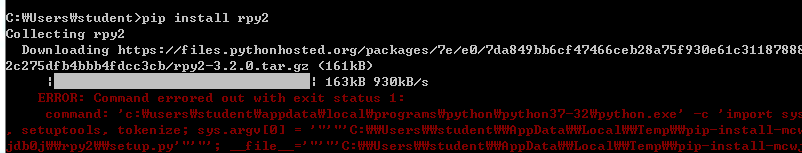
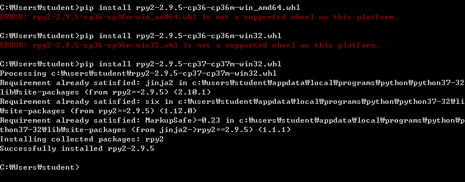
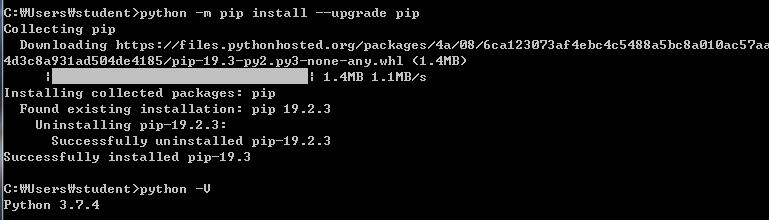
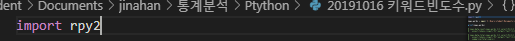
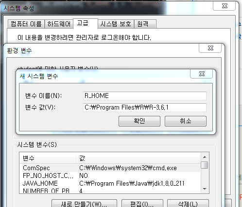

# 20191016 파이썬에서 R 실행시키기

> 구글링을 계속해서 해보니 Rpy2를 이용해서 실행을 하면 R을 파이썬 환경에서도 실행 할 수 있다고 한다. 그래서 이번 목표는 "**파이썬에서 어떻게 R을 시키는가?**" 에 대해서  알아보려 한다.


### 1. Rpy2 다운





> 시작부터 순탄치 않다. pip을 이용해서 다운을 받으려 했으나 어떤 이유에서 실패. 찾아보니 Rpy2를 다운 받는 것에 에러가 많이 나온다고 한다. 그래서 다른 방법을 찾았다.


### 1-1 whl파일을 이용해서 다운

>  https://www.lfd.uci.edu/~gohlke/pythonlibs/#rpy2

우선은, 위의 사이트에서 whl 파일을 다운 받는다. 음... 다음으로는 User 폴더에 다운받은 파일을 넣어준다. 예를 들어서 나의 디렉토리는 아래의 이미지와 같다.


그리고 cmd 창에서 다운 받은 파일의 경로를 찾아들어가고 pip으로 실행을 히며보지만... 아래의 에러가 또 뜬다. 이 플팻폼에서 저 파일은 지원되는wheel이 아니란다. ... 하...


..

.

.멀까?????? 하다가 계속해서 구글링 



일단 계속해서 찾다가 버전의 문제가 있을 수 있다고 판단해서 python pip 업그레이드. 그리고 한가지 더 찾은것이 64bit라서 amd64가 나는 같은 bit라고 생각을 했다 하지만 그렇지가 않다. 64 앞에 붙은 amd 는 다른 기반. 그래서 다운을 받을 때 win32 로 받아야 한다. 


모든 환경을 맞춰주니 아래와 같이 다운 성공 !!!



> 참고: https://zabda100su.tistory.com/226


### 1-2. 파이썬에서 R 돌리기





위의 방식으로 rpy2 다운 받고 cmd로 인스톨을 시켰다. 그리고 import를 하니 에러없이 뜬다 ㅠ.ㅠ (행복해) 다시 구글링을 돌려본다. 이제 만들었던 R소스를 파이썬에서 돌려야 하기에...

#### 1차시도... 실패

```r
from rpy2.robjects import r

r('x<-mom(100)')
r('y<-x + rnorm(100,sd=0.5)')
r('plot(x,y)')
r('lmout<-(y~x)')
coef=r('lmout$ceefficients')
print (coef[0],coef[1])

에러

RuntimeError: The R home directory could not be determined.

    Try to install R <https://www.r-project.org/>,
    set the R_HOME environment variable to the R home directory, or
    add the directory of the R interpreter to the PATH environment variable.

```


> set the R_HOME environment variable to the R home directory, or
> add the directory of the R interpreter to the PATH environment variable. 요 에러를 중점으로 찾아보니 stack over flow에서 다른 누군가가 물어봤더군요.



#### 2차 시도

```r
import rpy2.robjects as r
import os

os.environ['R_HOME'] = 'C:/Program Files/R/R-3.6.1/bin/R.exe'

r('x<-mom(100)')
r('y<-x + rnorm(100,sd=0.5)')
r('plot(x,y)')
r('lmout<-(y~x)')
coef=r('lmout$ceefficients')
print (coef[0],coef[1])
```


요래 해주면 된다해서 일단 코드를 쳐놓고 R_HOME 해서 실해해봐도 똑같음. 그래서 R_HOME 을 인터넷에 쳐보니 시스템 속성에서 환경 변수를 고쳐주는 방법이 있어서 시도. 실ㅍㅐ................


음... 그외에도 많은 시도끝에 실패.. 일단 보류..